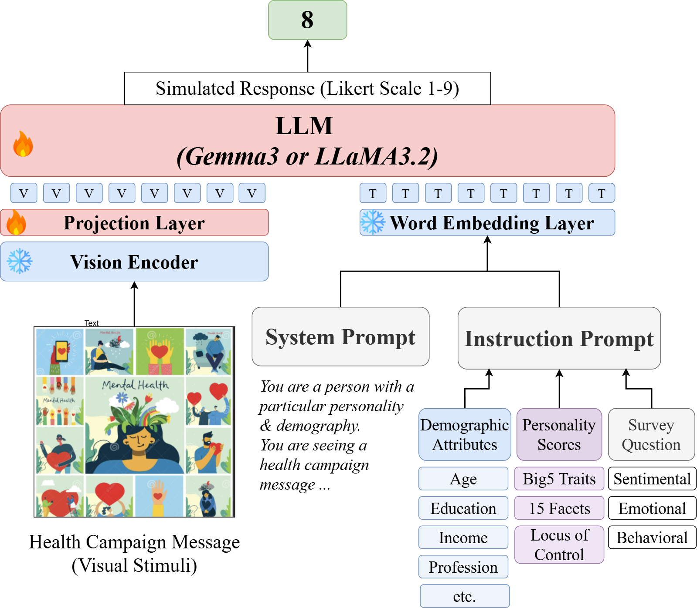
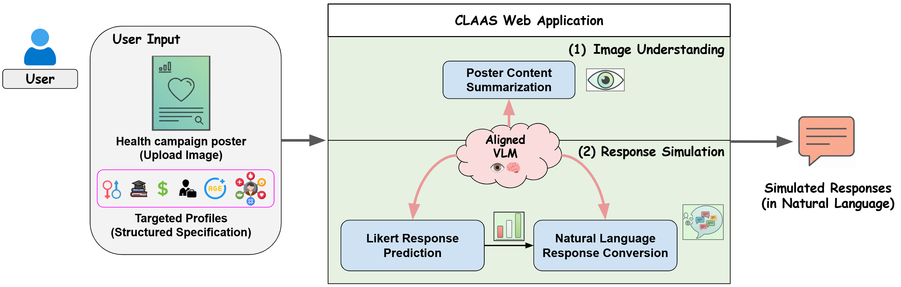

# 🌱 CLAAS: Conditional LVLM-enabled Attribute-Aware Response Simulation for Public Health Education  
[](#)
[](#)

<p align="center">
    <br><br>
    <br>
</object>
</p>


---
## I. Installation
```bash
# 1. Clone repository and navigate to project directory
git clone https://github.com/anh-nn01/claas.git
cd /path/to/claas/  # Replace with your project directory
# 2. Create and activate virtual environment
python3.12 -m venv venvs/llm
source ./venvs/llm/bin/activate
# 3. Install dependencies
pip install -r requirements.txt
```
---
## II. Training & Simulation Workflow
### Step 0. Environment Activation
```bash
export WORKDIR=/path/to/claas/  # Replace with your project directory
export TMPDIR=$WORKDIR/tmp
mkdir -p $TMPDIR
source ./venvs/llm/bin/activate
cd src
```
---
### Step 1. SFT Dataset Split & Creation
**Purposes:**
1) Generate structured training- and testing-split datasets for SFT **trait-aware alignment**. 
2) Train and test set is split based on health poster's communication strategy (each poster has only 1 corresponding strategy).

#### Script: SFT Dataset Split Generation
```bash
# Option D1: Full traits (All demographics + Big5 + Facet + Locus of Control)
python create_dataset_task1.py --demo_full --include_big5 --include_facet --include_locus
# Option D2: Partial traits (9 selected demographics + Big5)
python create_dataset_task1.py --include_big5
```

<p align="center">|-------------------- <b>[Optional Reading on SFT Dataset Structure]</b> ---------------------|</p>

#### (a) Processed SFT Dataset Structure
Each processed dataset split contains:
* **`instruction` / `Input`**: Prompts parsed with participant attributes (demographics, personality traits, visual stimuli).
* **`answer` / `Target`**: Processed ground-truth responses (Likert-scale numerical values or impact labels).
* **`set`**: Dataset split assignment (`train` / `test`).
#### (b) Prerequisites
* Ensure the pre-screened source dataset exists at: `data/survey_responses_screened.csv`.
* *Note: If generated holdout CSVs already exist in `data/`, you can skip this split processing step.*
#### (c) Holdout Splits by Poster's Communcation Strategy
* **Split 1:** **"Neutral" Communication Strategy Holdout**
  * Train (`task1_it_train_holdout_neutral.csv`): Demographic/Personality Attributes + GT responses to `["threatening", "self-efficacy"]` posters.
  * Test (`task1_it_test_holdout_neutral.csv`): Demographic/Personality Attributes + GT responses to `["informational / neutral"]` posters.

* **Split 2:** **"Self-Efficacy" Communication Strategy Holdout**
  * Train (`task1_it_train_holdout_efficacy.csv`): Demographic/Personality Attributes + GT responses to `["threatening", "informational / neutral"]` posters.
  * Test (`task1_it_test_holdout_efficacy.csv`): Demographic/Personality Attributes + GT responses to `["self-efficacy"]` posters.

* **Split 3:** **"Threatening" Communication Strategy Holdout**
  * Train (`task1_it_train_holdout_threatening.csv`): Demographic/Personality Attributes + GT responses to `["self-efficacy", "informational / neutral"]` posters.
  * Test (`task1_it_test_holdout_threatening.csv`): Demographic/Personality Attributes + GT responses to `["threatening"]` posters.


---
### Step 2. Attribute Alignment Training: VLM-Enabled Response Prediction
Attribute-Aware VLM Alignment Training using LoRA with Unsloth (`configs/trainer_config.py`).
```bash
# Multimodal trait-aware response prediction
# Note: Use 'gemma' when --visual_stimuli is False
python train_pred_llm.py \
   --model gemma \
   --visual_stimuli True \
   --n_epochs 1 \
   --test_style neutral
```
**Key Training Arguments:**
* `--model`: `[gemma, llama, qwen]`
* `--visual_stimuli`: `[True, False]` (ablation study on visual impact)
* `--test_style`: `[neutral, efficacy, threatening, train_on_all]`
* `--partial_traits`: `[True, False]` (use full or partial traits)
* `--n_epochs`: Number of training epochs (default: `1`)
---
### Step 3. Inference: Attribute-Aware VLM-enabled Response Prediction
Run inference and record model responses across benchmarking and attribute-aligned models.
```bash
# Inference: configure weights and paths in `configs/task1_model_inference.yaml`
python inference_pred_llm.py

# Inference ablation studies:
# Configure options in `configs/task1_model_inference_ablat.yaml`
```
* Evaluation outputs are saved to `src/evals/`.
* Responses are recorded per column as dictionaries: 
    `{"Q1": int, "Q2": int, ..., "Q13": int}` representing different survey questions and Likert-scale answers.
#### Evaluated Model Baselines:
* **Gemma 3:** `gemma3-12b` (Zero-shot / FT), `gemma3-4b` (Zero-shot / FT)
* **Gemma 3 Ablations:** `gemma3-4b` (No-vision FT, No-trait FT, No-trait zero-shot)
* **Llama 3.2:** `Llama3.2-11B-Vision` (Zero-shot / FT)
* **Qwen 2.5:** `Qwen2.5-VL-7B` (Zero-shot / FT)
---
### Step 4. Model Evaluation & Performance Analysis
Open and run `healthai_model_analysis.ipynb` to:
1. Measure model performance and alignment using predicted and ground-truth (GT) Likert-scale responses.
2. Evaluate each model only on its corresponding held-out test set, where responses are associated with an unseen communication strategy.
3. Compute random baselines at evaluation time:
  - `policy-random-uniform`: samples responses uniformly at random.
  - `policy-random-priors`: samples responses according to prior distributions.
---


## ⏳ TODO
- [ ] Add webpage for the project
- [ ] Update Likert2Language module with close-source model APIs (e.g. GPT-5.6)
- [ ] Upload Colab link to evaluation notebook


## 📜 Citation
```bibtex
To be updated
```


